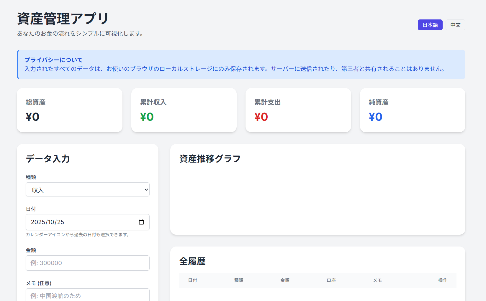

# 資産管理アプリ | Asset Tracker & Exchange Logger
これは、サーバーを必要とせずにブラウザだけで動作する、高機能な個人資産管理アプリケーションです。収入、支出、複数の銀行口座残高を記録し、グラフで可視化します。さらに、日本円と中国元の為替レートを記録する独立した機能も備えています。 すべてのデータはあなたのブラウザのローカルストレージにのみ保存され、外部に送信されることは一切ありません。プライバシーを最大限に尊重した設計です。

This is a powerful personal asset tracking application that runs entirely in your browser without needing a server. It allows you to track income, expenses, and balances across multiple bank accounts, visualizing the data with charts. It also includes a separate tool for logging JPY to CNY exchange rates. All data is stored exclusively in your browser's local storage and is never sent externally, ensuring maximum privacy.

---
## 日本語
### 概要
このWebアプリは、あなたの月々の収入・支出・預金残高を記録し、資産の推移を可視化するためツールです。最大3つの銀行口座を個別に管理でき、銀行名やグラフの色も自由にカスタマイズ可能です。また、日本円から中国元への両替レートを記録する便利な機能も搭載しています。
### 主な機能
- **ダッシュボード**: 総資産、累計収入、累計支出、純資産をひと目で確認できます。
- **データ入力**: 収入、支出、預金残高を日付と金額、オプションのメモと共に入力できます。
- **資産推移グラフ**: 収入、支出、各銀行口座の残高の推移を月ごとの折れ線グラフで自動描画します。
- **全履歴**: 入力したすべてのデータを一覧で確認でき、不要なデータは個別に削除できます。
- **銀行口座の設定**: 3つの銀行口座の名前とグラフの色を自由に設定できます。
- **利率計算ツール**: 期間、前後の残高、入金額からおおよその年利を計算します。
- **為替レート記録**: 日本円(JPY)と中国元(CNY)の両替履歴を記録し、レートの変動を確認できます。
- **多言語対応**: UIの表示言語を日本語と中国語で切り替えられます。
### 起動方法 特別なインストール作業は一切不要です。
1. **ファイルを保存**: このプロジェクトにある `main.html` ファイルをあなたのコンピュータにダウンロード（保存）します。
2. **ブラウザで開く**: 保存したHTMLファイルを、FirefoxやGoogle ChromeなどのWebブラウザで開きます。 以上でアプリが起動し、すぐに使い始めることができます。
### データの保存と削除について
- **自動保存**: このアプリには「保存」ボタンはありません。データを入力したり設定を変更したりするたびに、**自動でブラウザ内に保存されます。** アプリを閉じても、次回同じファイルを開けば前回の状態が復元されます。
- **一件削除**: 履歴の一覧の右端にある「削除」ボタンから、個別のデータを削除できます。
- **全データ削除（初期化）**: すべてのデータを消去したい場合は、ブラウザの開発者ツールを使う必要があります。
1. アプリを開いた状態で `F12` キーを押し、開発者ツールを開きます。
2. 「ストレージ」タブ → 「ローカルストレージ」を開きます。
3. `assetTrackerData` というキーの項目を見つけ、右クリックして削除します。
4. ページを再読み込みすると、アプリが初期化されます。
---
## 中文 (Chinese)
### 简介
这是一款功能强大的个人资产管理网页应用，无需服务器，仅在浏览器中即可运行。您可以记录收入、支出以及多个银行账户的余额，并通过图表实现可视化。此外，本应用还包含一个独立的工具，用于记录日元(JPY)到人民币(CNY)的汇率。 所有数据仅保存在您浏览器的本地存储空间中，绝不会发送到任何外部服务器，最大限度地保障您的个人隐私。
### 主要功能 
- **仪表盘**: 一目了然地查看总资产、累计收入、累计支出和净资产。
- **数据录入**: 可以按日期、金额以及可选的备注来记录收入、支出和存款余额。
- **资产趋势图**: 自动生成月度折线图，展示收入、支出和各个银行账户余额的变化趋势。
- **全部历史记录**: 在列表中查看所有已输入的数据，并可以单独删除不需要的条目。
- **银行账户设置**: 可自由设定最多三个银行账户的名称和图表颜色。
- **利率计算器**: 根据期间、期初/期末余额以及存款金额，计算出大致的年利率。
- **汇率记录**: 记录日元(JPY)兑换人民币(CNY)的历史，方便查看汇率波动。
- **多语言支持**: 用户界面可以在日语和中文之间切换。
### 如何启动 无需任何特殊的安装过程。
1. **保存文件**: 将项目中的 `main.html` 文件下载（保存）到您的电脑上。
2. **用浏览器打开**: 使用 Firefox 或 Google Chrome 等现代网页浏览器打开已保存的 HTML 文件。 这样应用就会启动，您可以立即开始使用。
### 关于数据的保存与删除
- **自动保存**: 本应用没有“保存”按钮。每当您输入数据或更改设置时，数据都会**自动保存在您的浏览器中。** 即使关闭应用，下次打开同一文件时，之前的所有状态都会被恢复。
- **删除单条记录**: 在历史记录列表的右侧，点击“删除”按钮即可删除单条数据。
- **删除所有数据（初始化）**: 如果您想完全重置应用，需要使用浏览器的开发者工具。
1. 在应用页面按 `F12` 键打开开发者工具。
2. 找到“存储” (Storage) 标签页 → 打开“本地存储空间” (Local Storage)。
3. 找到名为 `assetTrackerData` 的项目，右键点击并选择删除。
4. 刷新页面后，应用将恢复到初始状态。
---

---
## 更新履歴 (Change Log)
2025-10-25 (v1.1.0)
- 入力と表示の多通貨対応：支持多货币输入与显示,数据录入时，可选择货币(JPY/CNY)
- 動的為替レート機能：动态汇率功能
- 利率計算ツールのUI改善：改进了利率计算器的用户界面

2025-10-22 (v1.0.0)
- プロジェクトの初期リリース：项目初始版本发布